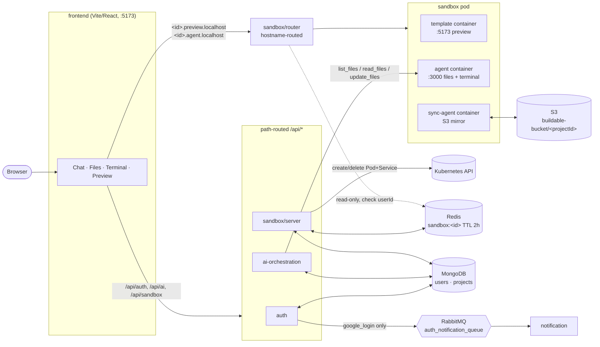
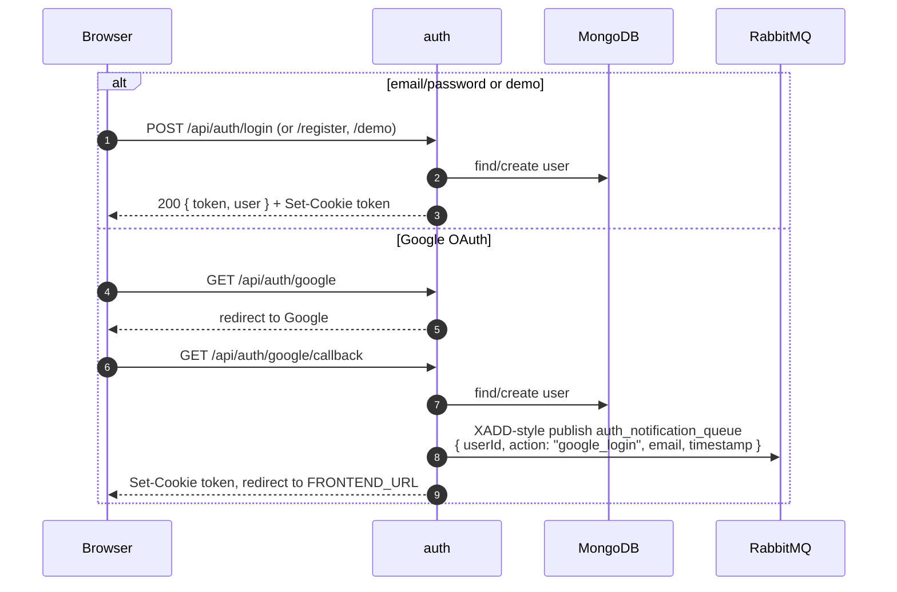
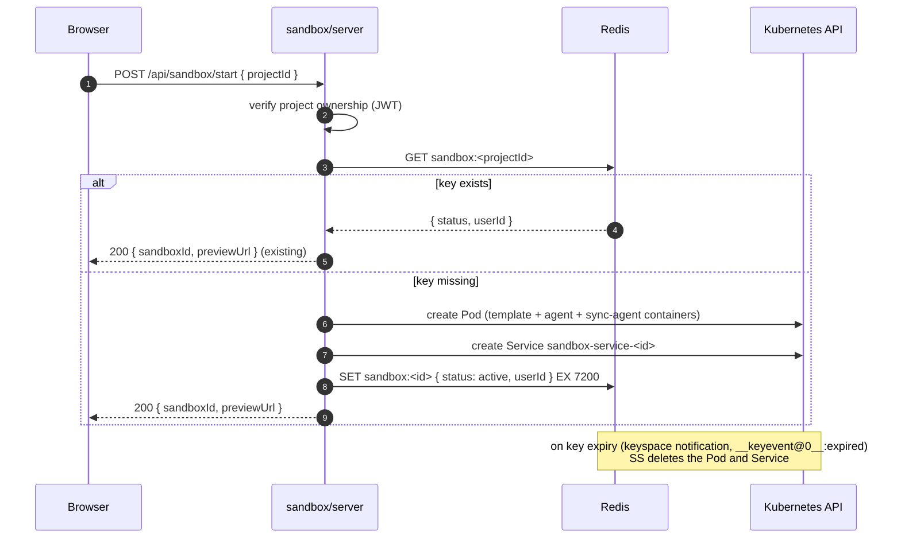
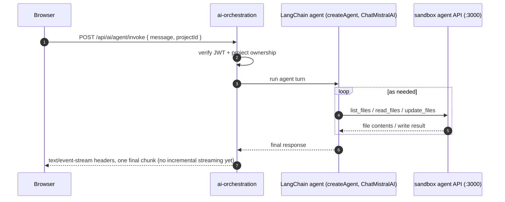

# buildable

An AI website builder — chat with an agent, watch it edit files inside a live, isolated sandbox, and see the result in a real preview + terminal in the browser. A Turborepo/Bun monorepo of small Express services plus a Kubernetes-based sandboxing layer.

## How it works

The frontend talks to the backend two different ways, depending on what it's asking for. Regular API calls (`/api/auth/*`, `/api/ai/*`, `/api/sandbox/*`) are routed **by path** to `auth`, `ai-orchestration`, and `sandbox/server` respectively. Everything involving a running sandbox — the live preview, the file API, the terminal — is routed **by hostname**: `<sandboxId>.preview.localhost` and `<sandboxId>.agent.localhost` both resolve through `sandbox/router`, which proxies (HTTP and WebSocket upgrades) straight into that sandbox's Kubernetes pod.

Each sandbox pod runs three containers on one shared `emptyDir` volume at `/workspace`: a `template` container serving the live Vite preview on 5173, an `agent` container exposing a file API + terminal over Socket.IO on 3000, and a `sync-agent` container that mirrors every file change up to S3 (pods themselves are ephemeral — S3 is the durability layer). `ai-orchestration`'s coding agent never touches the filesystem directly; its tools call the same in-pod agent HTTP API the frontend's file explorer uses.

## System diagram



## Request flows in detail

### Sign in

`register` / `login` / `demo` all set the same httpOnly `token` cookie; Google OAuth goes through Passport and additionally publishes a notification event.



Only the Google path publishes to RabbitMQ — plain email/password and demo logins never trigger a notification email.

### Starting a sandbox



### AI chat message



### Terminal

The pod runs a single shared `node-pty` bash process — not one per socket — spawned once when `sandbox/agent` starts.

```mermaid
sequenceDiagram
    autonumber
    participant BR as Browser (xterm.js)
    participant AGT as sandbox/agent (Socket.IO)
    participant PTY as shared node-pty process

    BR->>AGT: connect (via sandbox/router, &lt;id&gt;.agent.localhost)
    BR->>AGT: emit terminal-input
    AGT->>PTY: ptyProcess.write(data)
    PTY-->>AGT: data
    AGT-->>BR: io.emit terminal-output (broadcast to all connected sockets)
    Note over AGT,PTY: on any socket disconnect, AGT kills the PTY —<br/>every other connected client's terminal dies too
```

## Stack

| Layer | Choice |
| --- | --- |
| Runtime | Bun (`bun@1.3.9`), also the package manager |
| Monorepo | Turborepo + Bun workspaces |
| Backend services | Express 5, six independently runnable apps |
| AI agent | `langchain` (`createAgent`) + `@langchain/mistralai` (`ChatMistralAI`, `mistral-large-latest`), Zod for tool schemas |
| Auth | JWT (`jsonwebtoken`) in an httpOnly cookie or `Authorization: Bearer`, Passport Google OAuth20, `bcryptjs` |
| Sandbox orchestration | `@kubernetes/client-node` (direct K8s API calls from `sandbox/server`) |
| Sandbox proxy | `http-proxy-middleware` + `httpxy` (WS upgrade support) in `sandbox/router` |
| Terminal | `socket.io` + `node-pty` (real PTY, not a simulated shell) |
| Sandbox persistence | `chokidar` file watcher + `@aws-sdk/client-s3`, since sandbox pods use an ephemeral `emptyDir` volume |
| Messaging | RabbitMQ (`amqplib`) for login-notification events |
| Cache/liveness | Redis (`ioredis`), keyspace notifications drive sandbox teardown |
| Database | MongoDB via Mongoose (pinned `8.9.5`), shared through `@repo/mongodb` |
| Frontend | React 19, Vite, Tailwind CSS v4, `socket.io-client`, `@xterm/xterm` — no router or state-management library; view switching is plain `useState` in `App.tsx` |
| Deploy | Docker + Kubernetes, Skaffold for local cluster dev |

## Repository layout

```
apps/
  frontend/            Chat panel, file explorer/viewer, xterm.js terminal, preview iframe (:5173)
  auth/                 Register/login/demo/Google OAuth, JWT issuance, publishes login events
  notification/          RabbitMQ consumer — sends login-notification emails via nodemailer
  ai-orchestration/       LangChain coding agent; tools call the sandbox pod's agent API
  sandbox/
    server/              Control plane — project CRUD (Mongo), pod/service lifecycle (K8s), sandbox:<id> Redis key
    router/               Hostname-based reverse proxy into running sandbox pods (HTTP + WS)
    agent/                 Runs inside every pod — file API + Socket.IO terminal (node-pty)
    sync-agent/            Runs inside every pod — S3 restore on boot, then streams changes up
    template/              The Vite+React app seeded into every new sandbox's workspace
packages/
  mongodb/              Shared Mongoose models (user, project) + connection helper
  ui/                    Shared React component stubs (mostly unused Turborepo scaffolding)
  eslint-config/         Shared ESLint configs
  typescript-config/      Shared tsconfig bases
docker/                 docker-compose.yml + nginx.conf — full stack behind an nginx reverse proxy
k8s/                    Deployments, services, ingress, RBAC, secrets for a real cluster
skaffold.yml            Builds all nine app images and deploys everything under k8s/ for local K8s
```

## Commands

From the repo root:

```sh
bun install                 # install all workspaces
bun run dev                 # turbo run dev (all apps, persistent/watch)
bun run build                # turbo run build
bun run lint                  # turbo run lint
bun run check-types            # turbo run check-types
bun run format                  # prettier --write "**/*.{ts,tsx,md}"
```

`bun run dev` literally starts every workspace at once, including apps meant to run only inside a sandbox pod — see the port-collision note in [Local development](#local-development) before using it unfiltered. Run a single app instead of the whole graph:

```sh
turbo dev --filter=@repo/auth
turbo dev --filter=frontend
```

Or `cd` into an app and run its own `dev` script directly — `bun --watch run src/index.ts` for `auth`/`ai-orchestration`/`sandbox/server`/`sandbox/sync-agent`/`notification`, `vite` for `frontend`/`sandbox/template`, and `tsx watch` for `sandbox/agent`/`sandbox/router` (the two apps still run via `tsx`, not Bun — `sandbox/agent` needs the native `node-pty` module).

There are no test scripts anywhere in this repo — CI (`.github/workflows/ci.yml`) runs `bun install --frozen-lockfile`, `lint`, `check-types`, and `build` only, then builds+pushes a Docker image per app to Docker Hub on push to `main`.

## API reference

Authenticated routes accept the JWT as either an `Authorization: Bearer <token>` header or the httpOnly `token` cookie set at sign-in.

**Auth** (`/api/auth`)

| Method | Route | Auth | Notes |
| --- | --- | --- | --- |
| POST | `/register` | none | `{email, password, name}` → sets cookie, returns `{id, email, name, avatar}` |
| POST | `/login` | none | `{email, password}` |
| POST | `/demo` | none | creates/reuses a `demo@buildable.dev` user |
| GET | `/me` | JWT | current user |
| POST | `/logout` | none | clears the `token` cookie |
| GET | `/google` | none | Passport Google OAuth redirect |
| GET | `/google/callback` | none | publishes to `auth_notification_queue`, sets cookie, redirects to `FRONTEND_URL` |

Plus unauthenticated `GET /_status/health` and `GET /_status/ready`.

**AI agent** (`/api/ai/agent`, entire router requires JWT)

| Method | Route | Notes |
| --- | --- | --- |
| POST | `/invoke` | `{message, projectId}` → verifies project ownership, responds with `text/event-stream` headers but writes the full reply as a single chunk once the agent run finishes |

Plus unauthenticated `GET /api/status/health`.

**Sandbox** (`/api/sandbox`, all routes require JWT)

| Method | Route | Notes |
| --- | --- | --- |
| POST | `/project` | `{title}` → creates a project document |
| GET | `/project` | lists the caller's projects |
| DELETE | `/project/:id` | deletes the project doc + best-effort pod/service/Redis-key teardown |
| POST | `/start` | `{projectId}` → returns an existing sandbox or provisions a new Pod+Service, `{sandboxId, previewUrl}` |

Plus unauthenticated `GET /api/sandbox/health`.

**Sandbox agent** (in-pod, no `/api` prefix, no auth of its own — access is gated upstream by `sandbox/router`)

| Method | Route | Notes |
| --- | --- | --- |
| GET | `/` | health check |
| GET | `/list-files` | recursive listing of the workspace, excludes `node_modules`/`.git`/`dist` |
| GET | `/read-files?files=a,b,c` | comma-separated relative paths |
| PATCH | `/update-files` | `{updates: [{file, content}]}` |
| POST | `/create-files` | `{files: [{file, content}]}` |

Plus Socket.IO: client emits `terminal-input`, server broadcasts `terminal-output` (see [Terminal](#terminal) above).

## Local development

Requires Bun 1.3+ and Docker.

```sh
git clone <repo-url> buildable && cd buildable
bun install
```

**1. Environment files**

Each app reads its own `.env` and throws on startup if a required variable is missing. `@repo/mongodb` has its own `config.ts` that separately requires `MONGO_URL` — since it calls `dotenv.config()` with no path, it reads from whichever process imports it, i.e. effectively from that *app's* own `.env` file, not a dedicated one. `auth`, `ai-orchestration`, and `sandbox/server` all import from `@repo/mongodb`, so all three need `MONGO_URL` set even though only `ai-orchestration`'s own `config.ts` explicitly validates it.

| File | Required vars | Optional |
| --- | --- | --- |
| `apps/auth/.env` | `JWT_SECRET`, `GOOGLE_CLIENT_ID`, `GOOGLE_CLIENT_SECRET`, `RABBITMQ_URL`, `MONGO_URL` (via `@repo/mongodb`, not validated by auth's own `config.ts`) | `AUTH_PORT`, `GOOGLE_CALLBACK_URL`, `COOKIE_DOMAIN`, `FRONTEND_URL` |
| `apps/ai-orchestration/.env` | `AI_PORT`, `MISTRAL_API_KEY`, `JWT_SECRET`, `MONGO_URL` | — |
| `apps/sandbox/server/.env` | `SANDBOX_PORT`, `SANDBOX_MONGO_URL`, `JWT_SECRET`, `REDIS_URL`, `AWS_REGION`, `AWS_ACCESS_KEY_ID`, `AWS_SECRET_ACCESS_KEY`, **and** `MONGO_URL` (via `@repo/mongodb` — see note below) | — |
| `apps/sandbox/router/.env` | `ROUTER_PORT`, `REDIS_URL`, `JWT_SECRET` | — |
| `apps/sandbox/agent/.env` | `AGENT_PORT` | — |
| `apps/sandbox/sync-agent/.env` | `AWS_REGION`, `AWS_ACCESS_KEY_ID`, `AWS_SECRET_ACCESS_KEY` | `PROJECT_ID` |
| `apps/notification/.env` | `EMAIL_USER`, `GOOGLE_CLIENT_ID`, `GOOGLE_CLIENT_SECRET`, `GOOGLE_REFRESH_TOKEN`, `RABBITMQ_URL`, `NOTIFICATION_PORT` | — |

The same `JWT_SECRET` must be shared by `auth`, `ai-orchestration`, `sandbox/server`, and `sandbox/router` — each verifies tokens independently.

`sandbox/server`'s `SANDBOX_MONGO_URL` is validated at startup but never actually read anywhere else in its code — the real Mongoose connection is opened by `@repo/mongodb` against `MONGO_URL`. As checked in, `apps/sandbox/server/.env` sets `SANDBOX_MONGO_URL` but not `MONGO_URL`, so running `sandbox/server` locally with that file as-is throws at import time; Docker Compose works around it by setting both variables to the same connection string for that container.

**2. Infra**

```sh
cp docker/.env.example docker/.env   # fill in JWT_SECRET, Google OAuth, Mistral key, etc.
docker compose -f docker/docker-compose.yml --env-file docker/.env up -d mongo redis rabbitmq
```

**3. Run**

Don't run a bare `bun run dev` from the repo root — it starts every workspace, including `sandbox/agent`, `sandbox/sync-agent`, and `sandbox/template`, which are meant to run only *inside* a sandbox pod. Their checked-in `.env`/`vite.config.ts` defaults collide with the control-plane services': `sandbox/server`, `sandbox/router`, and `sandbox/agent` all default to port 3000 (same as `auth`), and `sandbox/template`'s Vite server is hardcoded to port 5173 (same as `frontend`). Filter to the services you're actually iterating on instead:

```sh
turbo dev --filter=frontend --filter=@repo/auth --filter=@repo/ai-orchestration --filter=@repo/server --filter=@repo/router
```

| Service | Address |
| --- | --- |
| `frontend` | http://localhost:5173 |
| `auth` | http://localhost:3000 (`/api/auth`) |
| `ai-orchestration` | http://localhost:3002 (`/api/ai`) |
| `sandbox/server` | whatever `SANDBOX_PORT` you set — collides with `auth` at the checked-in default of 3000 |
| `sandbox/router` | whatever `ROUTER_PORT` you set — same default-3000 collision |
| `notification` | http://localhost:4000 |
| MongoDB / Redis / RabbitMQ | standard local ports |

`vite.config.ts`'s dev proxy only forwards `/api/auth` (→ `127.0.0.1:3000`) and `/api/ai` (→ `127.0.0.1:3002`) — there's no proxy entry for `/api/sandbox`, and no local equivalent of `sandbox/router`'s hostname-based `.preview.localhost`/`.agent.localhost` routing. Exercising the sandbox-creation, file-explorer, or terminal flows against a real Kubernetes cluster locally means going through **Docker Compose** or **Skaffold** (below), not the bare Vite dev server.

## Deployment

**Docker Compose** — builds and runs the entire stack behind nginx (`docker/nginx.conf` handles both path-based `/api/*` routing and the sandbox's hostname-based routing patterns):

```sh
docker compose -f docker/docker-compose.yml --env-file docker/.env up -d --build
```

**Local Kubernetes** (requires a cluster with the nginx ingress controller):

```sh
cp k8s/example-secret.yml k8s/secret.yml   # fill in real values — secret.yml is gitignored
skaffold dev
```

`skaffold.yml` builds all nine app images (`frontend`, `auth`, `ai-orchestration`, `notification`, `sandbox` (from `sandbox/server`), `router`, `agent`, `sync-agent`, `template`) and applies everything under `k8s/`. `ingress.yml` path-routes `/api/auth`, `/api/ai`, `/api/sandbox`, and `/` (frontend), and host-routes `*.preview.localhost` / `*.agent.localhost` to `router-service`. `rbac.yml` defines a `resource-manager` ServiceAccount + Role (`create`/`delete`/`get`/`list`/`watch` on `pods`/`services`) bound to the `sandbox-server` deployment, since that's the one service calling the Kubernetes API directly. There are no static manifests for the `agent`/`sync-agent`/`template` images — those three exist only as containers inside pods created dynamically at runtime by `sandbox/server`.

## Notes and limits

- **`sandbox/server`'s checked-in `.env` is missing a var it actually needs.** Its own `config.ts` only requires `SANDBOX_MONGO_URL`, which nothing else in the service reads — the real database connection comes from `@repo/mongodb`, which independently requires `MONGO_URL`. `apps/sandbox/server/.env` doesn't set `MONGO_URL`, so running this service locally as checked in throws at startup; Docker Compose avoids this by setting both.
- **An unfiltered `bun run dev` collides on ports.** `sandbox/agent`, `sandbox/sync-agent`, and `sandbox/template` are Bun/Turbo workspaces too, but they're designed to run only inside a Kubernetes-provisioned sandbox pod. Their checked-in defaults overlap the control-plane services: `auth`, `sandbox/server`, and `sandbox/router` all default to port 3000, and `sandbox/template`'s Vite server is hardcoded to 5173, same as `frontend`. Use `--filter` (or Docker Compose / Skaffold) rather than a bare root-level `bun run dev`.
- **The local Vite dev proxy doesn't cover the sandbox routes.** `vite.config.ts` only proxies `/api/auth` and `/api/ai` — there's no `/api/sandbox` entry and no local stand-in for `sandbox/router`'s hostname-based `.preview.localhost`/`.agent.localhost` proxying. The sandbox lifecycle, file explorer, and terminal are only reachable locally through Docker Compose or a real Kubernetes cluster (Skaffold), not the bare frontend dev server.
- **`/api/ai/agent/invoke` isn't token-by-token streaming yet.** It sets `text/event-stream` response headers and awaits the entire LangChain agent run, then writes the final AI message as one chunk — the frontend gets it all at once, not incrementally.
- **The in-pod terminal is a single shared PTY, not one per client.** `sandbox/agent` spawns one `node-pty` bash process at startup and broadcasts its output to every connected socket via `io.emit`. Any client disconnecting kills that PTY, which kills the terminal for every other connected client too.
- **Only Google OAuth login sends a notification.** `auth_notification_queue` is published to solely from the `/google/callback` route — email/password and demo logins never trigger a login email.
- **The notification consumer doesn't requeue on failure.** If a message fails to parse or the email send throws, `notification` logs the error and moves on without `nack`ing — malformed messages are silently dropped, not retried.
- **Env var names drift between files.** `k8s/example-secret.yml` / `docker/.env.example` reference `AI_MONGO_URL` and `MISTRALAI_API_KEY`, but the actual code reads `MONGO_URL` and `MISTRAL_API_KEY`; `turbo.json`'s `dev` task also passes through `SERVER_PORT`/`MONGODB_URL`, which match no `config.ts` in the repo. Double-check the variable name a given service actually validates before assuming a secrets template is correct.
- **No automated tests.** There are no `*.test.*`/`*.spec.*` files and no `test` script in any `package.json`; CI only runs lint, type-check, and build.
- **No LICENSE file** exists at the repo root yet.
